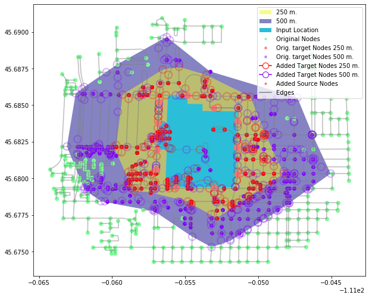
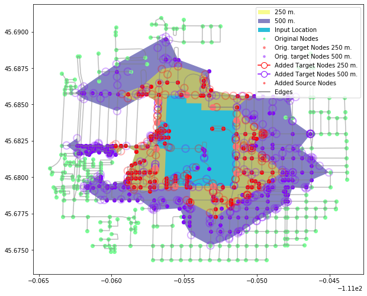
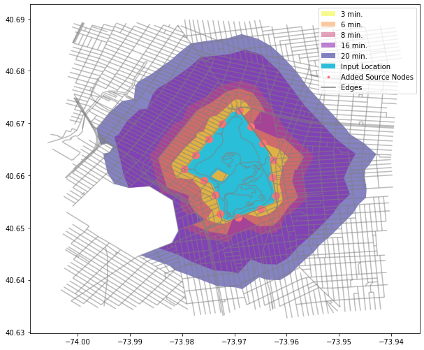
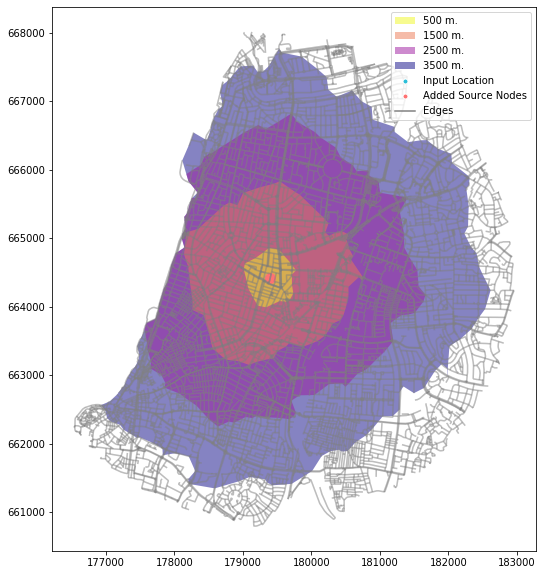
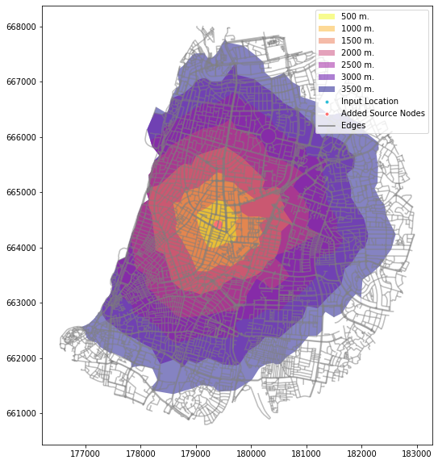

# isolines

**Street Networks Isolines and Isochrones**

Create Isolines and Isochrones for street networks.

**isolines** is a Python library for creating street networks isolines (equal-distance) 
and isochrones (equal-time) polygons with just one line of code. It is built on top of Shapely,
geopandas, NetworkX and osmnx.

**isolines** allows you to create isolines:
* from OSM data **without any data input** or * **use your own data**: your own network and source locations

## Main Features
   * Generation of isolines/isochroones for areas, segments, and point locations
   * Augmentation of the network for precise isoline/isochroone delineation
   * Based on a **concave hull** algorithm by default (for walking networks, otherwise convex hull is the default 
   and concave hull is optional)
   * Source location can be either an address string to be geocoded using OSM Nominatim or a shapely geometry
   * Accepts various graph inputs:  the ```GpdIsolimes``` class excepts edges GeoDataFrames and the
    ```NXIsoliner``` class accepts NetworkX graphs as input and the ```OsmIsolines``` class
    allows you tod downloads a street network from OpenStreetMap (OSM).
    ()
   
 #### Other Features
  * Easy built-in visualization
  * Dynamically tweaking isolines/isochroones delineation by re-setting the default
  knn parameter that controls the concave hull heuristic 
  * Dynamically adding isolines/isochroones to an existing instance
  * Extraction of the augmented output graph
  * Generation of nodes and edges GeoDataFrames
  

## Examples
A repository with a wide variety of examples can be found here: https://github.com/mlichter2/isolines_examples

* Create isolines/isochroones for complex geometries (polygons and linestrings) as well as simple point geometries

If you only want to output a GeoDataFrame of isolines/isochrones 
use the ```isolines``` function:

```python
import isolines as il
df = il.isolines('Prospect Park, Brooklyn, NYC, USA', metric = 'time',values=[3, 6, 9])
df
```
|  | geometry  | time  |
| ------- | --- | --- |
| 0 | POLYGON ((-73.9715 40.6492,... | 3 |
| 1 | POLYGON ((-73.9708 40.6470,... | 6 |
| 2 | POLYGON ((-73.9704 40.6448...	 | 9 |

However, if you which to explore your result with built-in visualization and be able to 
amend them and perform EDA use one of the following classes: ```GpdIsolimes, NXIsoliner, OsmIsolines```
```python
iso = il.OsmIsolines('Prospect Park, Brooklyn, NYC, USA', metric = 'time', values=np.arange(2.5, 22.5, 2.5), unit = 'ft', sample = 600)
iso.plot_isolines(figsize = (10, 10))
```


(for basic examples see also https://github.com/mlichter2/isolines_examples/blob/master/examples/01_basic_example.ipynb)

* The isolines/isochroones boundaries are not confined to the existing network nodes. The network is amended to  include
 new source and target nodes based on the input geometry and distances/times specified, so that large edges are cut in
 the respective location of new source/ target nodes to yield a more realistic isolines/isochroones boundary.
 the built-in visualization can can help explore and refine these boundaries.
```python
iso = il.OsmIsolines('Bozeman High School, Bozeman, Montana, USA',values=[250, 500],sample = 200)
iso.plot_isolines(plot_nodes=True, plot_source_nodes=True,figsize = (10,10))
```

* The output isolines/isochroones are based on a **concave hull** (rather than convex hull) heuristic by default
resulting in a more realistically shaped and accurate isolines/isochroones. These can be tweaked to get even more
refined delineation if needed
```python
iso.change_isolines(knn = 15)
iso.plot_isolines(plot_nodes=True, plot_source_nodes=True,figsize = (10,10))
```


(examples for refining boundaries can be found here:
 https://github.com/mlichter2/isolines_examples/blob/master/examples/03_refining_isolines_concave_boundaries_and_smoothing.ipynb)


* isolines lets you either download a network from **OpenStreetMap (OSM)** or use an edges **geopandas GeoDataFrame**
or use a **NetworkX graph**
In the example below, an edges GEoDataFrame from the US Census Tiger roads dataset is used
```python
import geopandas as gpd
import pandas as pd
from shapely.geometry import LineString
df = gpd.GeoDataFrame.from_file('../data/tl_2019_36047_edges/tl_2019_36047_edges.shp')
# pre-process: add edges in the opposite direction 
df2 = df.copy()
df2['TNIDF'] = df['TNIDT'].copy()
df2['TNIDT'] = df['TNIDF'].copy()
# reverse the line geometry coordinate sequence
df2['geometry'] = df['geometry'].apply(lambda x: LineString(x.coords[::-1]))
df = pd.concat([df, df2]).reset_index(drop = True)
tiger = il.GpdIsolines('Prospect Park, Brooklyn, NYC, USA',
                            edges = df,
                            network_type = 'walk',
                            metric = 'time',
                            values=[3, 6, 8, 16, 20],
                            edge_idcol = 'TLID', 
                            fromcol = 'TNIDF',
                            tocol = 'TNIDT',
                            sample= 400,
                            knn = 50
                                 )

tiger.plot_isolines(figsize = (10, 10))
```


(examples for using different data sources:
 https://github.com/mlichter2/isolines_examples/blob/master/examples/06_using_different_input_sources.ipynb,
 
 https://github.com/mlichter2/isolines_examples/blob/master/examples/07_example_using_US_Census_TIGER_dataset.ipynb)


* Add isolines to an existing instance

```python
from shapely.geometry import Point
isochrones = il.OsmIsolines(Point(179370.985,664422.488),
                                 network_type = 'walk',
                                 values=[500, 1500, 2500, 3500],
                                 crs = 2039,
                                 knn = 25)
isochrones.plot_isolines(figsize = (10, 10))
```

```python
isochrones.add_isolines([1000, 2000, 3000, 4000])
isochrones.plot_isolines()
```


(examples: https://github.com/mlichter2/isolines_examples/blob/master/examples/02_adding_isolines_and_isochrones.ipynb)

* Extract nodes and edges GeoDataFrames, NetworkX graphs
```buildoutcfg
nodes = isochrones.get_nodes()
edges = isochrones.get_edges()
G = isochrones.get_graph()
```